# Homelab Project: cooklab.local

## Introduction

The goal of this project was to emulate a small to medium-sized corporate network, complete with a domain, networked services, a guest network, and test users. The project has been built in Proxmox VE.

## Network Design

My network has two virtual switches, which are called Linux Bridges in Proxmox. The external switch is `vmbr0` and the internal switch is `vmbr1`. A Pfsense firewall with hostname **firewall01** that is connected to `vmbr0` on the WAN interface and `vmbr1` on the LAN interface. This allows me to isolate the lab environment from the rest of my home LAN, while also providing the appropriate level of connectivity between different VLANs on the network.

In keeping with the goal of emulating a medium sized office network, I have kept the subnet sizes relatively small on most VLANs. The following is a breakdown of the various VLANs on the internal switch:

| VLAN ID | CIDR               | Purpose                          |
|---------|--------------------|----------------------------------|
| 10      | 192.168.10.0/29    | Infrastructure                   |
| 20      | 192.168.20.0/27    | Sales Department                 |
| 30      | 192.168.20.32/27   | Marketing Department             |
| 40      | 192.168.20.64/27   | Finance and Administration Dept. |
| 100     | 192.168.100.0/28   | IT Department                    |
| 200     | 192.168.200.0/24   | Guest VLAN                       |

VLANs 20, 30, and 40 all allow for thirty host addresses, which is more than enough room to grow for small teams of twelve to fifteen employees. The IT deparment VLAN has a smaller CIDR for a smaller team of administrators and support agents. The Infrastructure VLAN is able to support six servers, which is enough to support the organization's technology needs. A Guest VLAN was created to emulate a Guest WiFi service. The Guest VLAN has no connectivity to any other VLAN, with the exception that clients on this VLAN can obtain a DHCP lease. Otherwise, ICMP is disabled and only ports 80 and 443 have been opened to the public Internet.

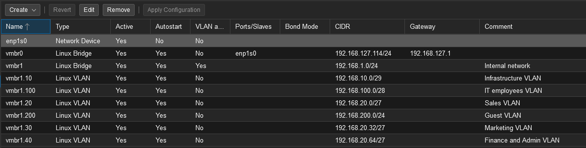
--------------------------

## Firewall Configuration

A big part of this project was correctly configuring various services on **firewall01**. The following shows the interfaces configured on the firewall:

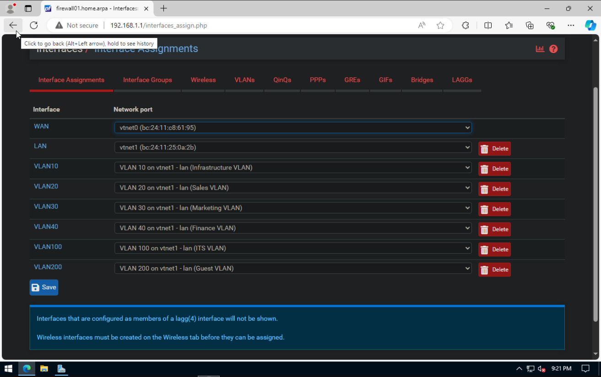

### DHCP Relay

In order to allow clients to receive an IP address lease, DHCP relay was necessary. DHCP Discover requests are broadcasts, and broadcasts cannot leave the local network, or broadcast domain, that they originate on. DHCP relay solves this problem by forwarding DHCP Discover broadcasts to specified servers on the Infrastructure VLAN. Enabling DHCP relay in Proxmox disables the ability to have the firewall provide DHCP for the network. While it would have been simple to configure DHCP on the firewall, most organizations prefer to use the DHCP server role on Windows Server for greater control and scalability. I enabled DHCP relay for all client VLANs and configured two upstream servers, which were configured for load balancing and replication.

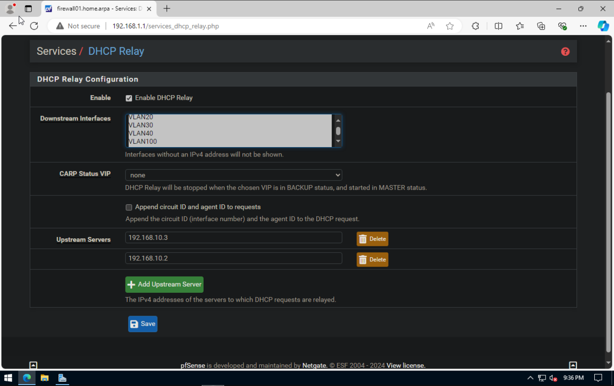

### Firewall Rules

Each client VLAN required outbound rules to allow web traffic, file sharing and necessary traffic for Active Directory. I created outbound rules for DNS (UDP port 53) and DNS over TLS (UDP port 853), HTTP (TCP port 80) and secure HTTP (port 443), as well as TCP port 445 for SMB file sharing. Additionally, I created the necessary rules for Active Directory, including LDAP, Kerberos, and Kerberos password changes. The final rule for each client VLAN denies all outbound traffic.

|Protocol|Port|Service|
|----|--------|-------|
|UDP|53|DNS|
|UDP|853|DNS over TLS|
|TCP|80|HTTP|
|TCP|443|HTTPS|
|TCP|445|SMB|
|TCP/UDP|389|LDAP|
|TCP|88|Kerberos|
|TCP|464|Kerberos password changes|
|TCP|49152-65535|RCP|
|TCP|135|RCP|


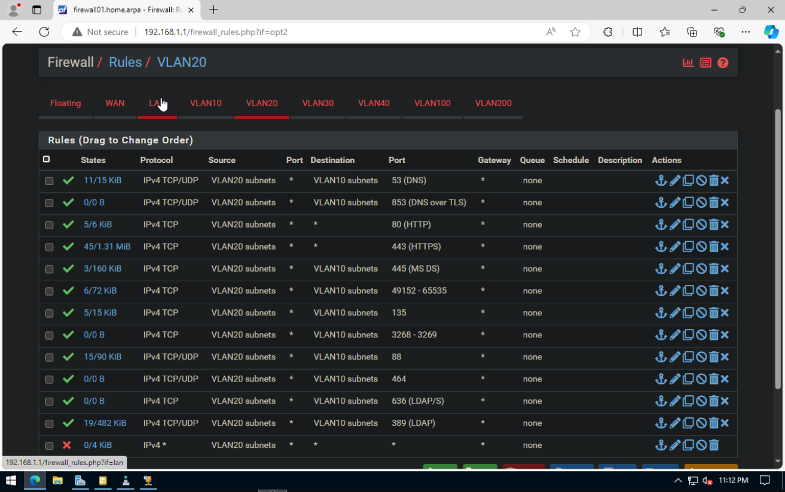

Additionally, inbound traffic for each of these protocols needed to be allowed into VLAN 10 for each client VLAN in order to have full network functionality. Fortunately, the Pfsense web configurator provides a convenient way to copy sets of rules while modifying the source value, making the creation of additional rules for each VLAN faster and less error-prone. Due to the large number of rules for VLAN 10 I won't include a screenshot here.

An interesting point is that while I allowed inbound traffic for port 464 Kerberos password changes on VLAN 10, I had initially forgotten to allow traffic destined for port 464 outbound from each client VLAN. This did not result in clients being unable to perform password resets as I would have expected, however it did appear to result in password resets taking an excessive length of time to complete. My research showed that when port 464 is unavailble, password changes may attempt to fall back on port 88. Needless to say, it was not ideal to have password changes take up to ten minutes to complete. Adding an outbound rule for destination port 464 for each client VLAN resolved this problem, allowing password resets to complete instantaneously.

#### Guest VLAN

Most organizations provide a means for guests to connect to the Internet without having access to resources on the corporate intranet. To achieve this, I created a Guest VLAN 200 with limited connectivity. DHCP relay was enabled for this VLAN, but otherwise all traffic to any other VLAN was blocked. I then created outbound rules for web and DNS traffic. This achieved the intended goal of allowing clients on this VLAN access to the web, and nothing more.

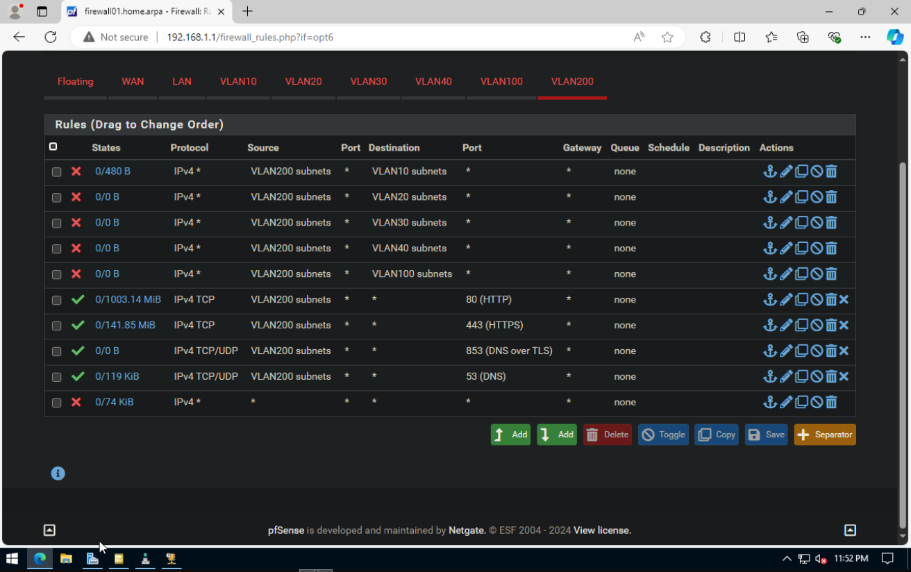

<!-- -------------------------------------- -->

## IP Addressing

To provide addressing for all client VLANs I installed the DHCP server role on both domain controllers, `DC01` and `DC02`. DHCP was not configured for the Infrastructure VLAN, with all devices receiving a static IP. `DC01` was configured with a IP of 192.168.10.2/29, and `DC02` was configured with an IP of 192.168.10.3/29.

DHCP was first installed and configured first on `DC02` and failover to `DC01` was configured afterward. There was no particular reason for this choice. The failover configuration was set to load balance mode, as both domain controllers would be handling Active Directory, so it made sense to ensure DHCP traffic be eveningly balanced between both servers as well so that a single server does not handle a disproportionate load.

I created individual scopes for each client VLAN with a lease time of eight hours, given this is a standard work day. Each scope was also configured with options to provide default gateway and DNS servers.

DHCP configuration on `DC02`:
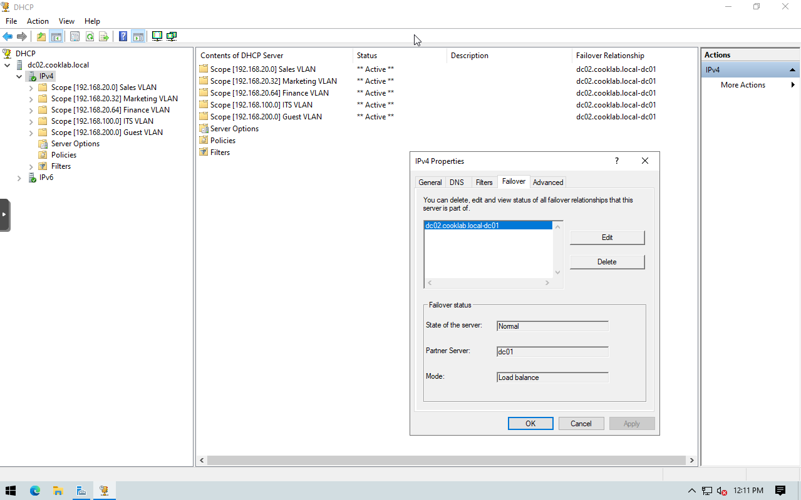

DHCP configuration on `DC01`:
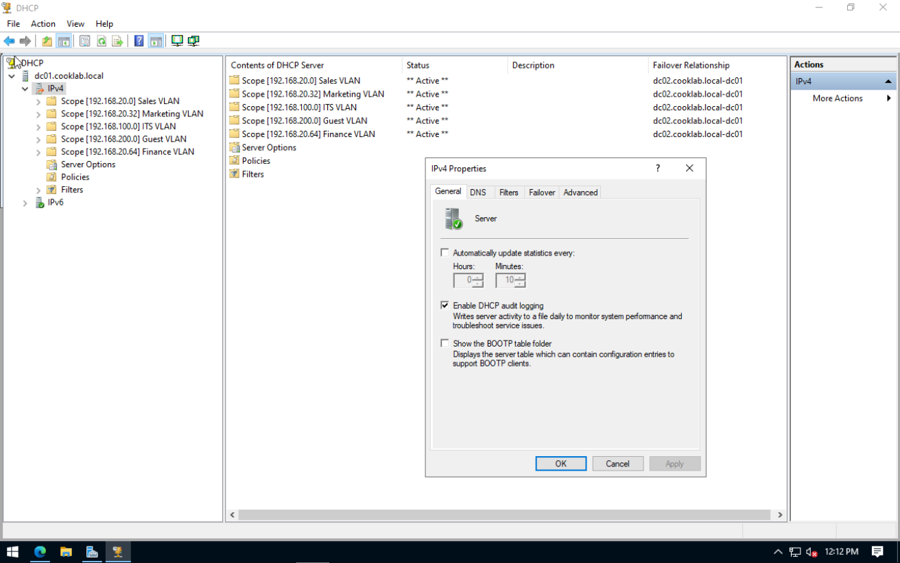

Example of scope configuration:
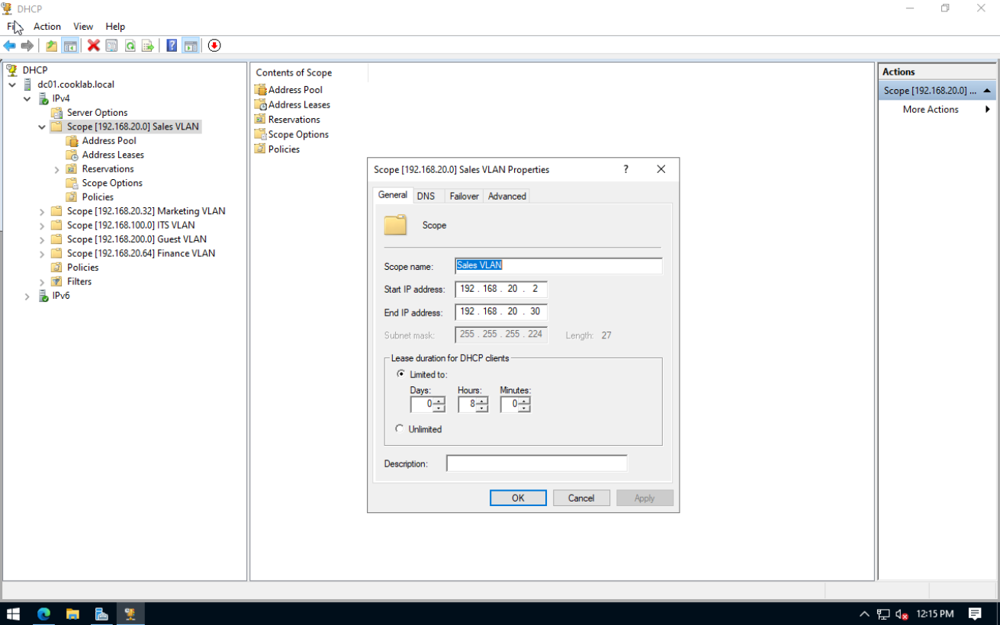

Example of scope options:
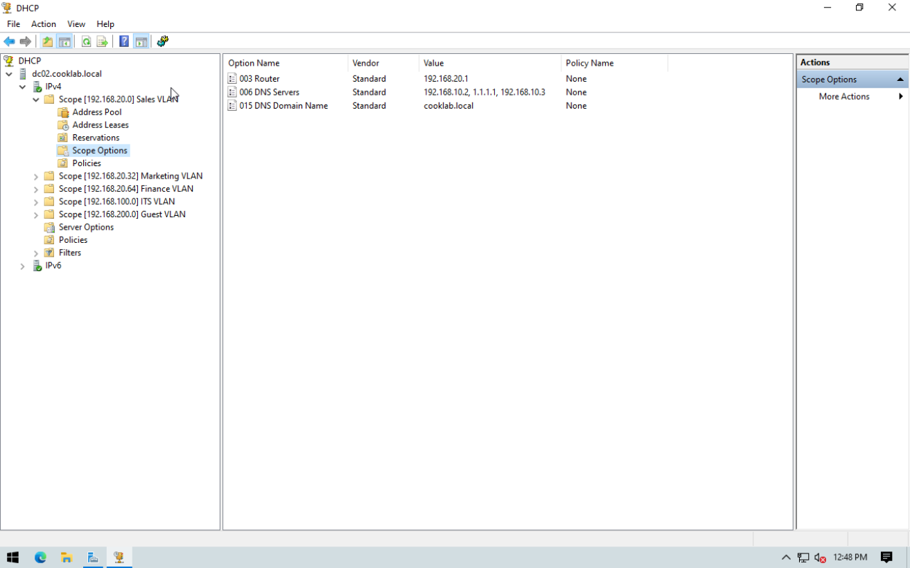

Example of client IP configuration:
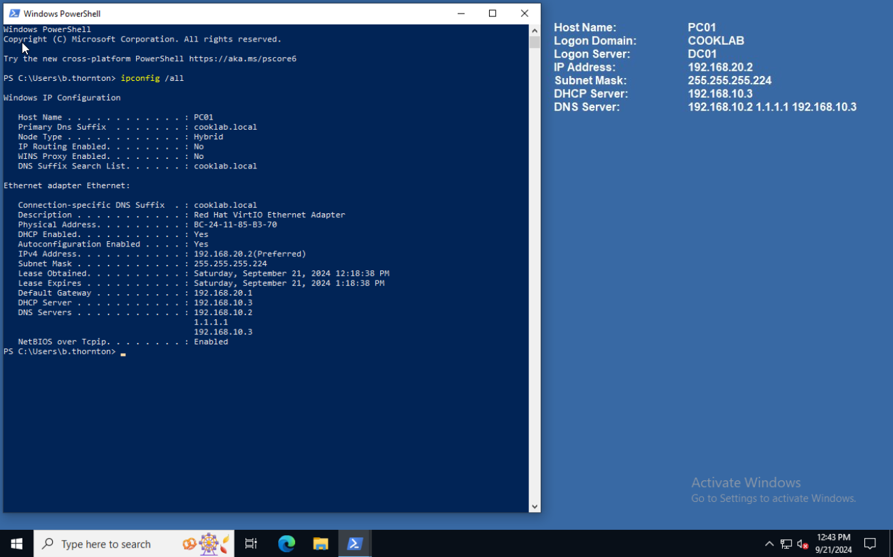

<!-- -------------------------------- -->

## Active Directory and DNS

`DC01` and `DC02` both have Active Directory Domain Services installed, and both host an Active Directory-integrated DNS zone with zone replication configured between servers. A new forest was created with the domain `cooklab.local` with a forest functional level of Windows Server 2016. For the time being, there are no additional sites or other domains in the forest. Both `DC01` and `DC02` host an Active Directory-integrated zone for `cooklab.local`.

Forest Info:
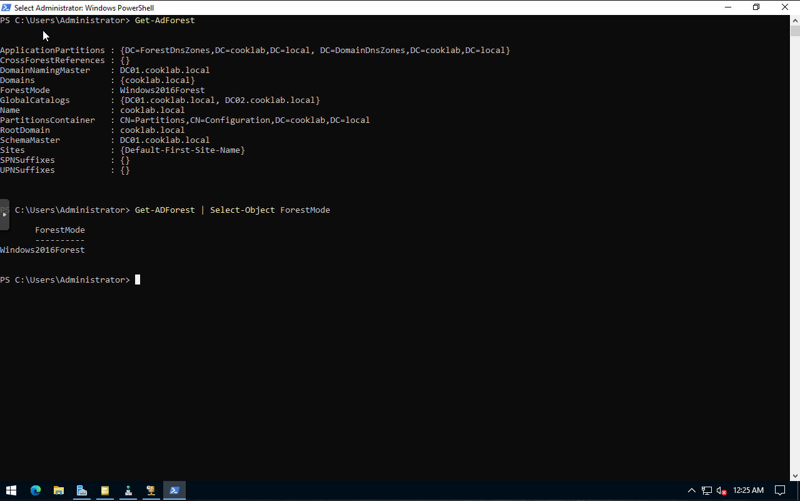

DNS:
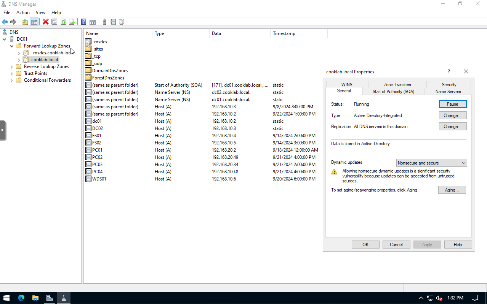

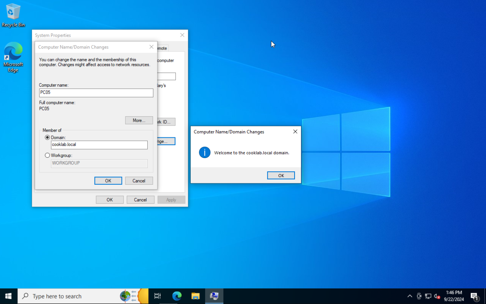

### Organizational Unit Structure

The organizational structure for users and computers was organized by department and by object type. Each department has an OU with a Users sub-OU and a computers sub-OU.

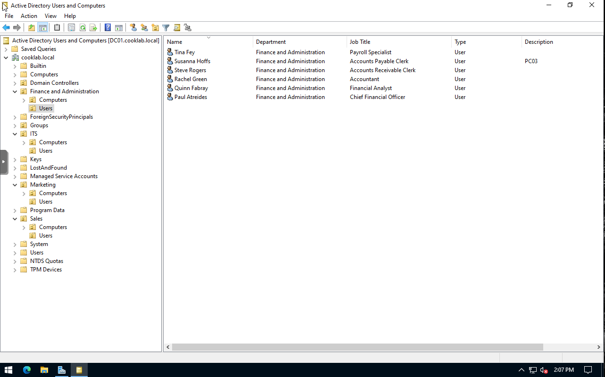
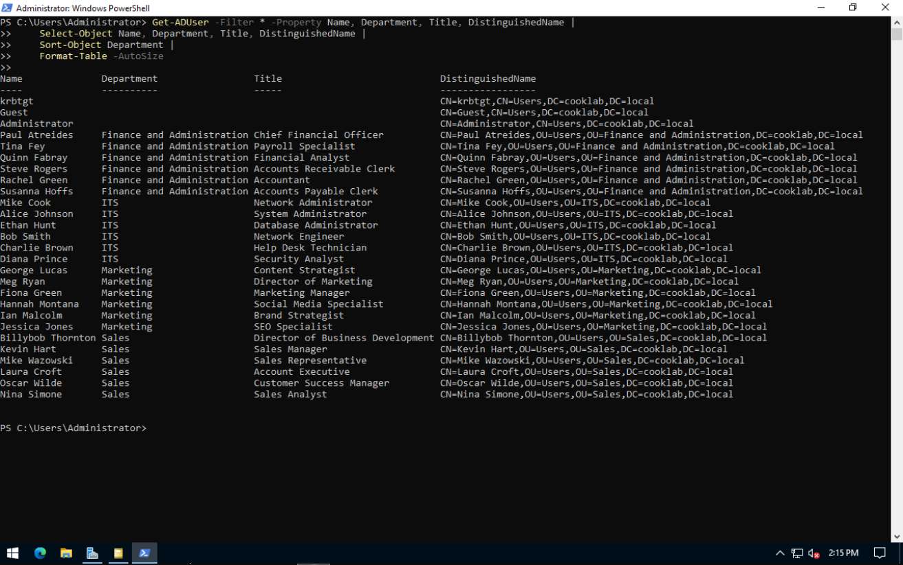

### Creating Test Users

Manually creating users and assigning them to organizational units becomes tedious very quickly. To create test users I write a script that reads user data from a CSV file and assigns them to the appropriate departmental security group and OU:

```ps
Import-Module Active Directory

$CsvPath = Read-Host -Prompt "Enter the full path to the users CSV file"
Write-Host "`n"

$Users = Import-Csv -Path $CsvPath

# Default initial password - not used in production
$Password = ConvertTo-SecureString "Windows1Windows19478!"

foreach ($user in $Users)
{
    New-ADUser -Name $user.name `
     -DisplayName $user.Name `
     -Department $user.Department `
     -Title $user.Title `
     -UserPrincipalName $user.UserPrincipalName `
     -SamAccountName $user.SamAccountName `
     -PasswordNeverExpires $true `
     -ChangePasswordAtLogon $true `
     -AccountPassword $Password `
     -Enabled $true

    $u = Get-ADUser -Identity $user.SamAccountName
    Add-ADGroupMember -Identity $user.Department -Members $u.DistinguishedName
    
    $dept = $user.Department
    Move-ADObject -Identity $u.DistinguishedName -TargetPath "OU=Users,OU=$dept,DC=cooklab,DC=local"
}
```

This script will be available in the GitHub repository for this project. I then used ChatGPT to generate test users in CSV format using the headers I specified. This allowed me to rapidly create users to populate AD Users and Computers and test logins for various departments. 


## File Sharing and DFS

It is common for organizations to centralize files in network shares, in fact, Server Message Blocks protocol was one of the first to be implemented on Microsoft networks in the 1980s. To provide file sharing on the cooklab.local domain I created two file servers, `FS01` and `FS02` that both have the File Server role installed. I added an additional 10 GB VHD to each virtual machine created an F: drive called Shares, and then created quick SMB shares on `FS01` for various departments in the organization.

I installed DFS Namespaces, DFS Replication and File Server Resource Manager roles on each file server and configured a DFS namespace called `\\cooklab.local\data` hosted on both `FS01` and `FS02`. Each of the department file shares was added to the DFS namespace.

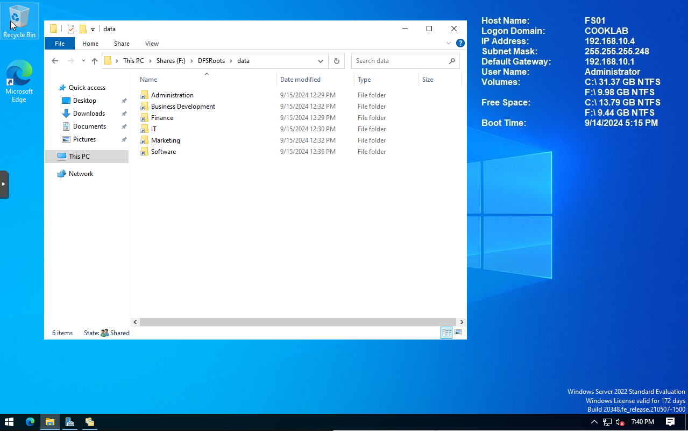

Additionally, I configured full-mesh replication between `FS01` and `FS02` to ensure all shares created on the primary file server are replicated and available on the secondary server. This was done for redundancy and high availability.

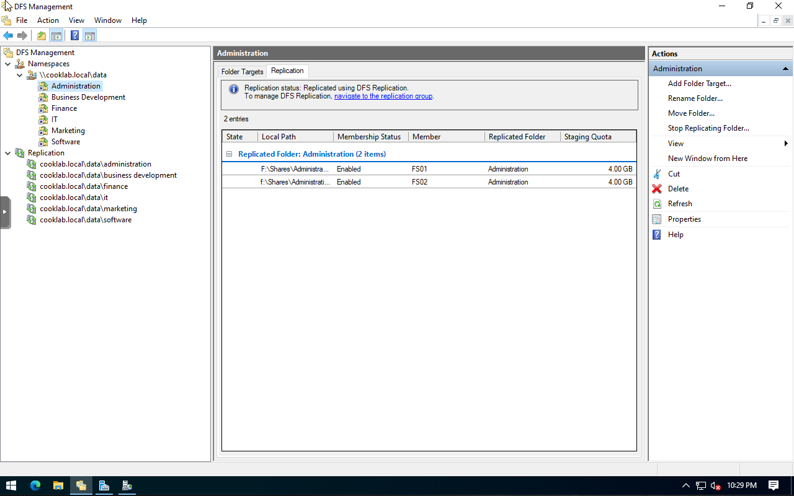

### File Screens

To enhance organizational security, I configured file screening for the Administration, Business Development, Finance, and Marketing Shares to prevent employees from adding file types they do not need to be able to use in their work. I created a file screen template to actively screen backup files, executables, system files and webpage files. I then applied this template to the shares mentioned above.

File screen template:
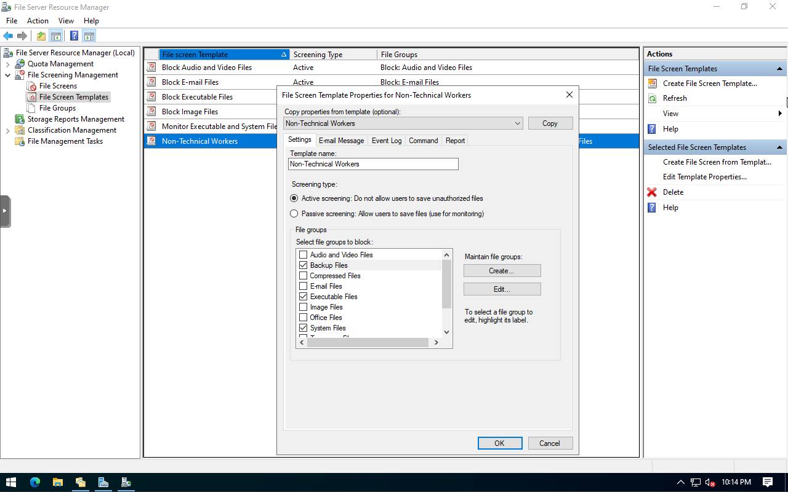

File screens:
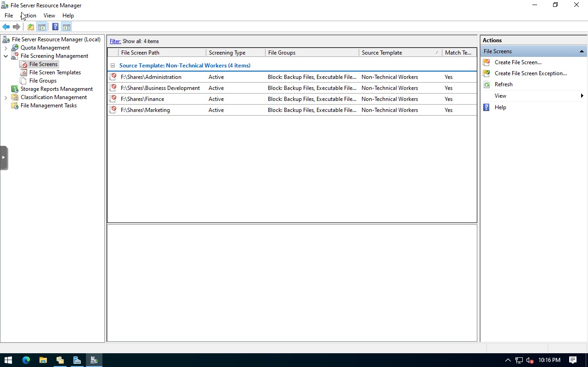

For now, I decided not to implement quotas. This would be a good idea to implement in the future.

### Mapping Department File Shares

Rather than expecting employees to remember the UNC path for their departmental file shares, I mapped shares to File Explorer for users based on department membership using group policy. I created a group policy object called Mapped Drives and edited `User Configuration>Windows Settings>Drive Maps` to create each drive map using the DFS name for each file share. I then targeted each drive map to users in the relevant department using item-level targeting.

Drive maps:
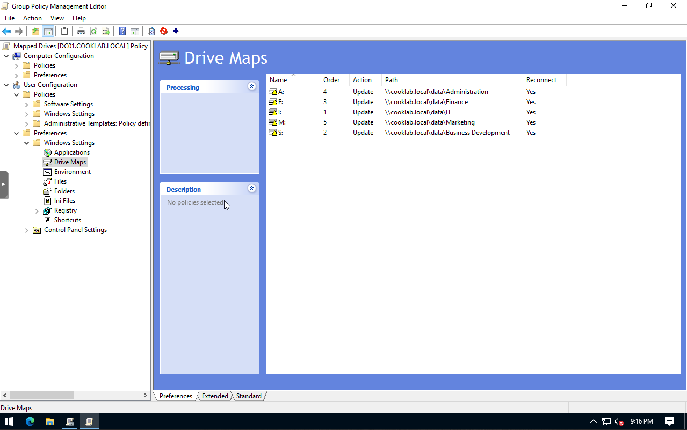

Example of targeting based on group membership:
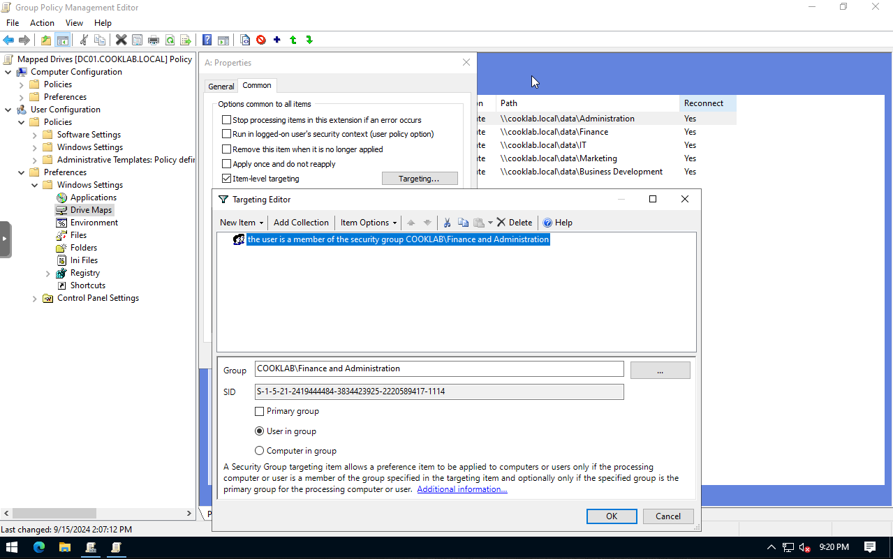

User who belongs to the Finance and Administration department group:
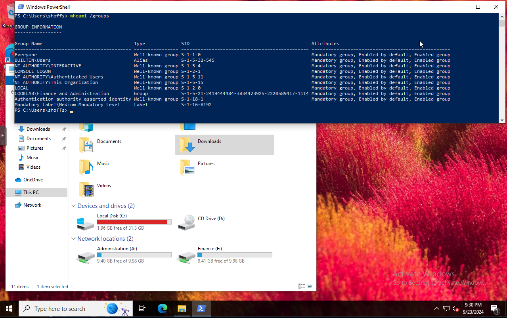

## Next Steps

This project represents just the beginning of a small to medium-sized corporate network. There is quite a bit more that can be done to provide additional networked services, enhance security and improve end user and IT employee experience through group policy.

Here are a list of next steps I would like to take with this project to enhance the project and extend my learning:

- Implement Entra ID Connect to sync users to Azure for a hybrid identity
- Implement Windows Deployment Services with an unattended install image for rapid client provisioning
- Set up additional sites with read-only domain controllers
- Set up a second domain in the forest
- Introduce additional group policies to enhance security of end devices and identities and install software
- Script more of the configuration of various services in PowerShell

